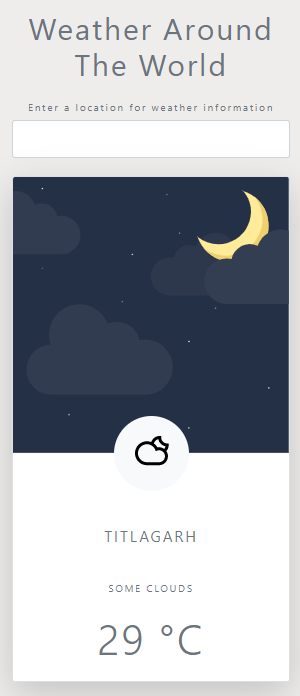

# Weather Around the world

Its a weather web app made using Javascript and [Accuweather API](https://www.accuweather.com/).
<h3>Enter any location & get to know the Weather and daytime 😉 </h3>

## Screenshots

 

## Contributing
Pull requests are welcome. For major changes, please open an issue first to discuss what you would like to change.
